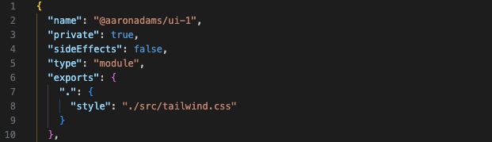
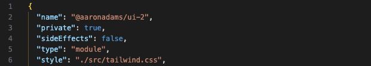

# Reproduction

GitHub issue: https://github.com/tailwindlabs/tailwindcss-intellisense/issues/933

## App 1

Child package uses `exports`: [packages/ui-1/package.json](packages/ui-1/package.json)

IntelliSense doesn't work in parent package: [apps/app-1/app/root.tsx](apps/app-1/app/root.tsx)

## App 2

Child package uses `style`: [packages/ui-2/package.json](packages/ui-2/package.json)

IntelliSense works in parent package: [apps/app-2/app/root.tsx](apps/app-2/app/root.tsx)

Both apps work correctly when running `remix:dev` (the text is red).
